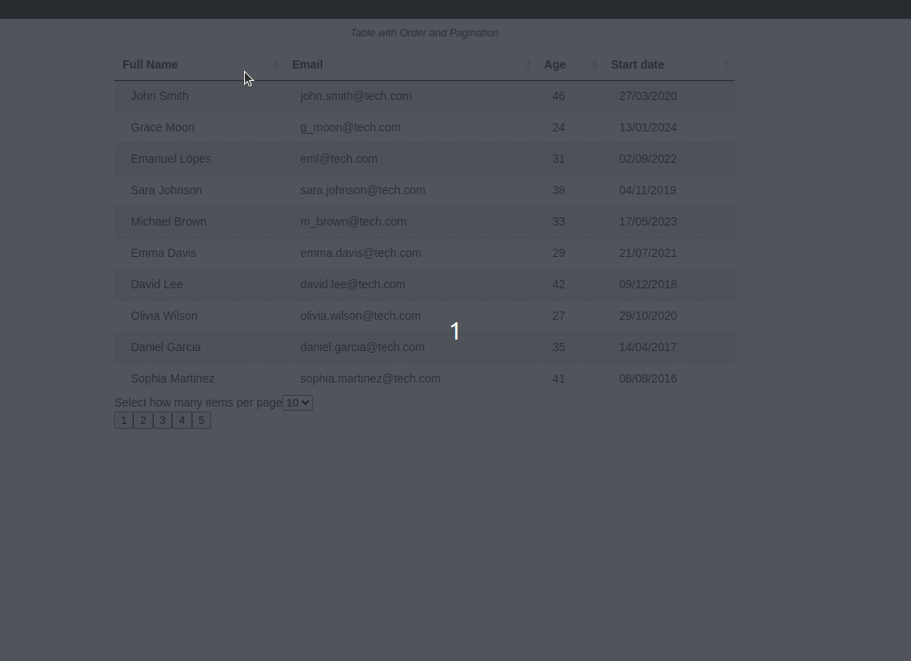

# Custom Sortable Table

## Description

This React component provides a customizable sortable table. Users can sort columns in ascending or descending order, control the number of items displayed per page, and navigate through the data using pagination buttons. 

Built with pure TypeScript and React, this component avoids external libraries for maximum control and flexibility.

See a live demo here: [Custom Sortable Table - Vítor F. Nery](https://custom-table-vitorfnery.netlify.app/)

## Technologies

- React
- TypeScript
- Vite
- Git & GitHub